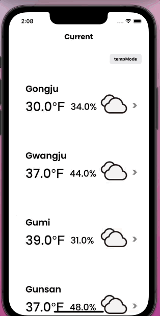
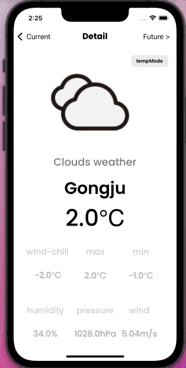
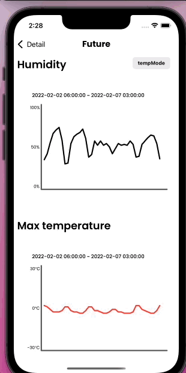
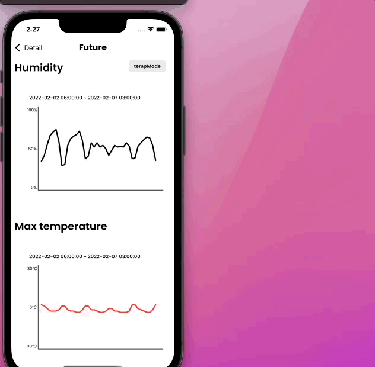

# today-weather☀️

- today-weather 는 `kanban project board` 로 `issue`, `pull request`를 통해 프로젝트를 관리했습니다.

- 현재날씨,현재날씨 상세 정보를 보여주고 미래날씨를 그래프로 알려주는 앱입니다.

## 구조

```
.
├── Info.plist
├── Storage.swift
├── API
│   └── WeatherSurvice.swift
├── Controller
│   ├── FirstViewController.swift
│   ├── SecondViewController.swift
│   └── ThirdViewController.swift
├── Model
│   ├── ForecastWeatherModel.swift
│   └── WeatherModel.swift
├── View
│   ├── Base.lproj
│   │   └── Main.storyboard
│   └── CustomTableViewCell.swift
└── ViewModel
    ├── ForecastWeatherViewModel.swift
    └── WeatherViewModel.swift
```

- `mvvm` 패턴을 적용하여 프로젝트를 구성했습니다.

- `Main.storyboard` : 스토리보드를 사용하여 UI를 구성했습니다.

- `CustomTableViewCell` : 첫 번째 화면의 tableView를 customCell로 구현했습니다.

- `FirstViewController` : 첫 번째 화면의 VC입니다. 도시들의 현재 날씨가 나오도록 구현했습니다.

- `SecondViewController` : 두 번째 화면의 VC입니다. 클릭한 도시의 상세 정보가 나오도록 구현했습니다.

- `ThirdViewController` : 세 번째 화면의 VC입니다. `scrollview` 를 넣어 스크롤을 할 수 있게 하였습니다.

  ​											 클릭한 도시의 미래날씨를 `uibezierpath`  를 통해 그래프로 그려 표현했습니다.

- `ForecastWeatherModel` : 미래 날씨 관련 JSON 파싱 구조체를 담고 있습니다.

- `WeatherModel` : 현재날씨 관련 JSON 파싱 구조체를 담고 있습니다.

- `ForecastWeatherViewModel` : 파싱한 미래날씨 JSON을 VC가 사용가능하게 프로퍼티로 만들었습니다.                                                     

- `WeatherViewModel `: 파싱한 현재날씨 JSON을 VC가 사용가능하게 프로퍼티로 만들었습니다.         


## 기능

### 첫 번째 화면

<p align="center">
  
</p>

- 첫 번째 화면은 우리나라의 각 도시의 날씨, 온도, 습도를 보여줍니다.
- tempMode 버튼을 누르면 섭씨, 화씨 변환이 가능합니다.
- 각 도시의 cell을 클릭하면 두 번째 화면으로 넘어갑니다.


### 두 번째 화면

<p align="center">
  
</p>

- 클릭한 도시의 상세 정보(체감온도, 최저기온, 최고기온, 기압, 풍속)을 알 수 있습니다.
- tempMode 버튼을 클릭하면 섭씨, 화씨 온도로 변환 됩니다.


### 세 번째 화면

<p align="center">
  
</p>

<p align="center">
  
</p>


- 클릭한 도시의 미래 5일간의 날씨를 3시간 간격의 그래프로 볼 수 있습니다.
- 습도, 최고기온, 최저기온에 대한 정보를 각각 꺾인선 그래프로 그렸습니다.
- tempMode 버튼을 누르면 화씨, 섭씨에 맞춰 그래프가 다시 그려집니다.
- 그래프가 가로모드에도 대응되도록 구현하였습니다.


## 사용 도구

| 개발 언어     | Swift     |
| ------------- | --------- |
| __개발 도구__ | __Xcode__ |

 
